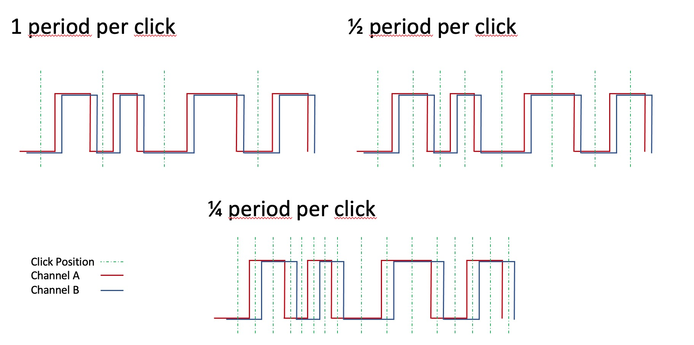
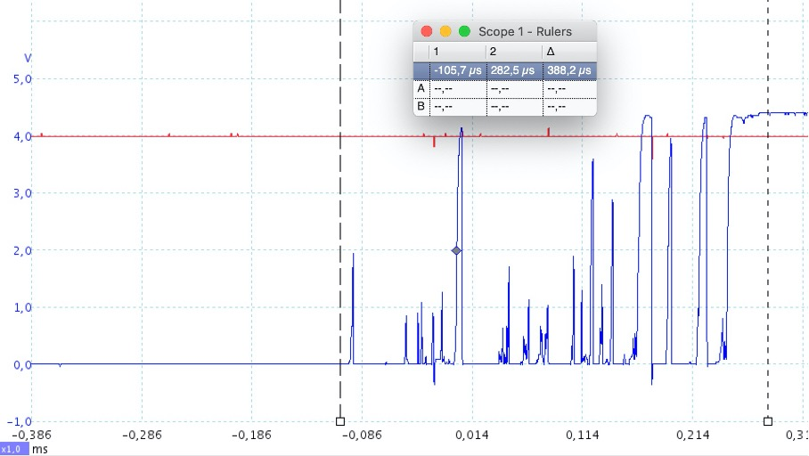
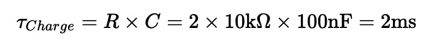
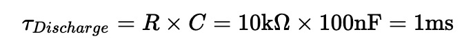
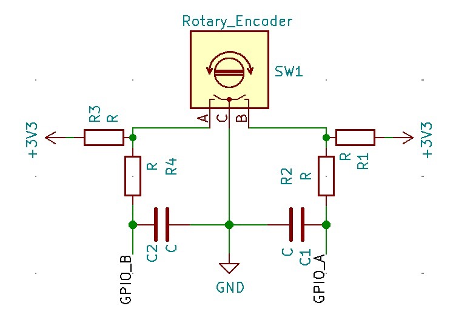
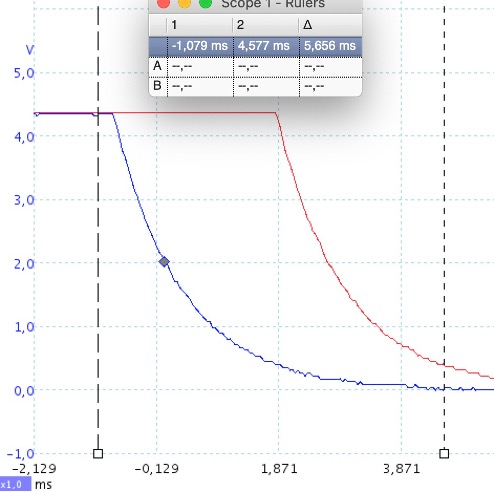
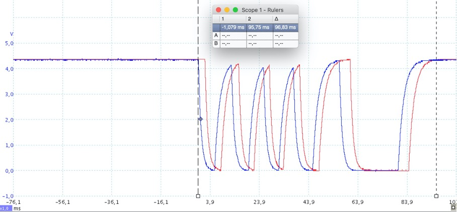
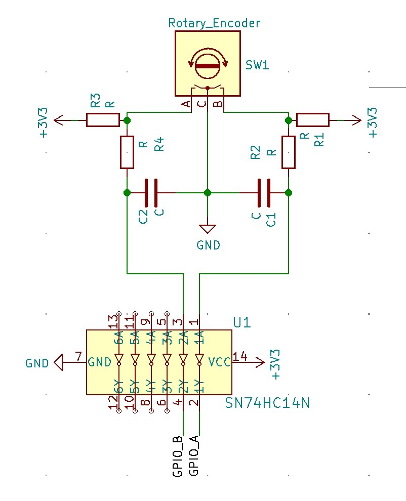
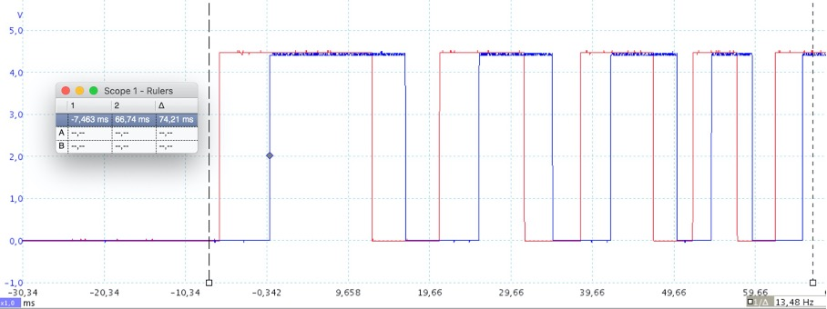

# Rotary Encoder II Plugin<!-- omit in toc -->
This is an alternative implementation of a rotary encoder driver for integration with Volumio. It dynamically loads device tree overlays to access the rotaries and is more responsive with the tested encoders than the existing plugin.   

- [Configuring the Plugin](#configuring-the-plugin)
- [Differences compared to _Rotary Encoder Plugin_](#differences-compared-to-rotary-encoder-plugin)
- [Tipps for debouncing your Encoder](#tipps-for-debouncing-your-encoder)
- [Linux Device Tree Overlay: Rotary Encoder](#linux-device-tree-overlay-rotary-encoder)
- [List of compatible Rotary Encoders](#list-of-compatible-rotary-encoders)
- [Potential future extensions](#potential-future-extensions)
- [Known issues and limitations](#known-issues-and-limitations)
- [References](#references)

## Configuring the Plugin
The plugin currently supports up to three encoders. The code is implemented in such a way, that this can quite easily be expanded - feel free to create a branch and do it.  
After installing the plugin, each encoder can be individually enabled in the settings.


  
**Img 1:** _Settings for one of the encoders_

After enabling an encoder, the following parameters can be set:
### Periods per step
There are different encoder types in the market. Many of them have a ratchet mechanism, so you can feel 'click' positions when you turn the knob.  
There are three different implementations in the DT overlay driver:
<ul>
<li>1/1: Full period per step<br>
From one tick to the next, both switches of the encoder perform a full cycle <i>on - off - on</i> (or vice versa)
<li>1/2: Half period per step<br>
From one tick to the next, both switches of the encoder perform half a cycle <i>on - off</i> (or vice versa)
<li>1/4: Quarter period per step<br>
From one tick to the next, only one of both switches of the encoder changes state. The other switch will change state with the next click in the same direction.
</ul>
If you are uncertain about your type, check the manufacturers datasheet or use a multimeter to measure the situation in your rotary.



**Img 2:** _Switching characteristic of different rotary types supported._


### Pin A GPIO/ Pin B GPIO
The GPIO pins that are connected to the A and B channels of your encoder.

### Dial Function
Pick the functionality you would like for your encoder:
<ul>
<li>Volume down/up
<li>Skip previous/next
<li>Seek backwards/forward
<li>Emit websocket message<br>
</ul>

The Emit function opens four additional text boxes for providing the websocket commands and data for clockwise (CW) and counter-clockwise (CCW) turns. It allows, to provide commands to a websock emitter and can be used to trigger other functions inside other plugins. For example, if you have a Plugin controlling a Dimmer with a function `dim` taking an argument `'up'` or `'down'` you would need to put 'dim' into both command fields and 'up' or 'down' into the respective data field.
You could also send Volumio Volume or Skip functions via this option (just to give you an idea):   
**Volume**: 
- Command CW: 'volume'
- Command CCW: 'volume'
- Data CW: '+' 
- Data CCW: '-'

**Skip**:
- Command CW: 'prev'
- Command CCW: 'next'
- Data CW: '' (empty, _prev_ takes no argument) 
- Data CCW: '' (empty, _next_ takes no argument)

**WARNING:**    
If you use the _Emit_ function, remember that a fast turn of the knob can send a lot of messages in short time, so the called function better be fast or prepared for 'flooding'.    
To assure fault-free operation is your responsibility in this case.

### Button GPIO
GPIO pin of your device that is connected to the encoder push button. 

### Debounce Time
If you do not have hardware debouncing for your push button, you can set a software debouncing time here. The unit is milliseconds, try values below 100ms, everything higher may generate poor user-experience.

### Button Logic-Level Active Low
By default the plugin assumes, that your GPIOs are pulled low and that the GPIO will become logical high, when you push the button. If your hardware works the other way round and your button pulls the GPIO low when pressed, you have to activate this switch.

### Short Press Action/ Long Press action
Various functionalities that can be associated with the push button. For compatibility I have added most functions that the initial _Rotary Encoder Plugin_ supports. Additionally there is a an Emit Function equivalent to the one available for the rotation. You find more information there.    
Long press action is executed if the button is pushed for longer than 1.5 seconds.   
Available Commands:
<ul>
<li>Play
<li>Pause
<li>Play/Pause toggle
<li>Stop
<li>Repeat
<li>Random
<li>Clear Queue
<li>Mute
<li>Unmute
<li>Toggle Mute
<li>System Shutdown
<li>System Reboot
<li>Emit websocket message
</ul>

## Differences compared to _Rotary Encoder Plugin_ 
The initial rotary encoder plugin by _Saiyato_ is built based on npm OnOff library and a derived onoff-rotary to read the GPIO pins of the Linux system (e.g. Raspberry Pi) and the implementation of the Gray-Code is tailored to the use of the KY040 encoder.  
With my custom made hardware using three _ALPS STEC11B03_ encoders, it worked but the response was not really satisfactory because the plugin would only respond on every second 'tick' of the encoder and would sometimes misinterpret the direction.  
I tried to improve it with hardware debouncing (see [here](#tipps-for-debouncing-your-encoder) for tipps) and by optimizing the implementation but the result was not satisfactory.      
I finally wrote my own implementation based on DT overlay driven rotary encoders giving me perfect results. Since the hardware debouncing is in my hardware anyway now, I did not bother to try the plugin without the Schmitt-Trigger - I guess that it would work without it, too. Feel free to leave a note, if you can confirm this.    
I first thought about implementing my solution into the existing plugin, but finally decided against it due to lack of time and because is rather an alternative than an extension.   
If your system does not support DT overlays or you run into other issues, the other plugin may still be your first choice. 
Feel free to try both Plugins and pick the one, that suits your application best.     
If this Plugin works for you and you use a new type of encoder, it would be nice if you add your model to the list of supported devices below, so others can pick one that is working.   
If you should observe problems, you may create an issue, but I have very limited time to look into that. I rely on enthusiasts to dig into the limitations of the plugin - the debug function in the settings is very chatty, so it should help to get to the issue fast.

## Tipps for debouncing your Encoder
Most encoders are very simple devices, that only consist of two mechanical switches, that are mechanically matched to toggle at different angular positions.   
Like all mechanical switches, they are not digitally flipping between on and off, but tend to 'bounce' between both states. That is not a problem if you switch a slow bulb, but a fast microprocessor input will notice.

    

**Img 3:** _Oscilloscope trace of one channel of an ALPS rotary encoder. You can see the bouncing during the transition from off to on. The bounce here takes about 400µs. The ALPS specification allows even up to 2ms._    

To filter the high frequency signals (the spikes) out, you can use a simple extension of your circuit with two resistors (R1 and R2) and a capacitor (C1) per channel.
I use four resistors of R=10kΩ and two capacitors of C=100nF. The timeconstant for charging is     
    
and for discharging     
     
respectively (after the timeconstant has passed the charge will be on _1/e_ of its reference level).      



**Img 4:** _Schematic of rotary with RC-filters for debouncing. C1 gets charged via R1+R2 when the switch is open and discharged via R2 when it is closed. The same setup is copied for the second channel._

This will remove the spikes but also slow down the transition between the states of the switch. As long as it is fast enough, that usually is no issue. To estimate what 'fast enough' means, consider the number of detents of your rotary and how fast you need to turn it (mine has 30 detents per revolution and a normal user does less than half a turn per second, so worst case there is a switch every 1000/20 = 50 Milliseconds).  



**Img 5:** _Both channels with RC-filter. The transition takes 6ms now(~10 times longer, still 10 times faster than needed), but the spikes are gone. I calculated the RC values based on the ALPS spec of up to 2ms bounce. You can see, that the voltage (i.e. charge on the capacitor) has reduced from 4.3V to 4.3V/2.7 = 1.6V after about 1ms, as expected with 10kΩ and 0.1µF._   

 

**Img 6:** _Both channels during a longer extra fast rotational move of about 120°. You can feel 10 'clicks' during the move shown (1/2 period per step). The speed of rotation determines the length of the peaks. When the speed increases much more, the peaks will not reach the high and low levels anymore, eventually causing problems when the GPIO can no longer distinguish a high from a low. This has to be taken into account when selecting your R and C. The turn shown is much faster, than what I expect to see from my normal user._   

If you want more crisp transitions with full amplitude again, you can add an additional Schmitt-Trigger like the _74HC 14_ (6-channels for less than 0.50€) on top of the RC-filter. That will change your rotary encoder signal to something very sharp and defined. However, make sure that input level still passes the upper and lower threshold of the Schmitt, if you turn the button fast.



**Img 7:** _The output of the RC-Filter connected to an additional Schmitt-Trigger. You should add a 100nF buffer-capacitor between VCC and GND and floating inputs should be pulled to a reference potential. (both not shown here)_


   
**Img 8:** _Input (red) and Output (blue) of the Schmitt-Trigger. You can see, that the signal makes a very sharp transition from low to high when the input falls below the threshold. Note, that the output is inverted, but for the rotary operation that does not matter._


  
**Img 9:** _Both channels with Schmitt-Trigger. A signal like from a text-book for digital logic. Note how you can even see the acceleration during the turn. The squares become shorter from left to right._   

## Linux Device Tree Overlay: Rotary Encoder
Even with a perfect signal from RC-filter and  Schmitt-trigger, there were still missed ticks sometimes. I could solve that by moving to the DT overlay driver for rotary encoders.     

Raspbian (and Volumio) support it out of the box. If you load the device-tree overlay for a rotary, you no longer need to take care of the Gray-Code and just hook up to a device that will nicely send you information about turns of the rotary encoder (relative or absolute, the plugin only supports relative so far).

The advantages of the dtoverlay solution:
- Very fast response, due to Kernel level implementation
- Versatile driver for use with all kinds of encoder types
- The dtoverlays can dynamically be loaded and unloaded, so integration was quite straightforward.

The plugin basically executes calls to dtoverlay for adding and removing overlays:   
To add a rotary:
```
sudo dtoverlay rotary-encoder pin_a=17 pin_b=27 relative_axis=1 steps-per-period=2 
```
To remove a rotary:
```
sudo dtoverlay -r 
```

The plugin is doing this when you change and save settings. You do not need to go to the command line.  

## List of compatible Rotary Encoders
The list currently lists only the ALPS Encoder I used for my project. I am convinced, that it works with others as well. I found some other projects using dtoverlay that use KY040 for example or other ALPS types.   
**_Please add yours to the list to help others. If you do not know how to edit this file in Github, create an issue with the information and I will integrate it someday._**

|Manufacturer|Model       |Periods/Position|HW-Debounce used     |
|------------|------------|----------------|---------------------|
|ALPS        |STEC11B03   | 1/2            |RC + Schmitt-Trigger | 


## Potential future extensions
- add the other parameters offered by the dtoverlay (e.g. absolute positioning, binary instead of Gray-code etc.)
- Add support for more than 3 encoders
- Add support for dtoverlays loaded at boot (similar to overlays for I2S DACs)

## Known issues and limitations
### Kernel warning when last overlay is removed
When the plugin is disabled, a kernel warning message about a potential memory leak is displayed when the last overlay is removed. I tried several things to prevent it and posted to several forums looking for help, but could not get rid of it. 
I consider it as not nice, but I could also not observe any issue after multiple disable/enable loops - so I decided to keep it as is for the time being.
During normal use, the plugin will be configured once only and then loaded at boot and unloaded at shutdown - so you should never experience an issue. I use it for several months already without issues.    
  

## References
### Device Tree Documentation
- [Kernel Documentation: rotary-encoder](https://www.kernel.org/doc/Documentation/input/rotary-encoder.txt)   
Explains more about how a rotary works and how the DTOverlay is implemented
- [Documentation of the `dtoverlay` command](https://github.com/raspberrypi/firmware/blob/master/boot/overlays/README)   
Search for 'rotary-encoder'. Alternatively, you can call 
  ```
  dtoverlay -h rotary-encoder
  ```
  from the command line.
- [Documentation of the Raspberry Device Tree](https://www.raspberrypi.org/documentation/configuration/device-tree.md)   
If you would like to learn more about the details of the dtoverlay function.

### NPM modules used
- [onoff](https://www.npmjs.com/search?q=onoff)   
Since it was easier to implement and does not have any issues, I still use _onoff_ for the push button. This could also be done with _dtoverlay_, but seems too much effort since it does not provide additional performance.

### Hardware Resources
- [RPi GPIOs](https://www.raspberrypi.org/documentation/hardware/raspberrypi/gpio/README.md)


